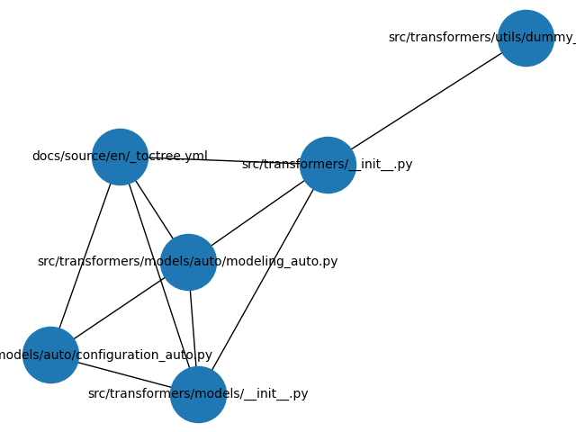

# Hugging Face Transformer Analysis
#### Fundamentals of Software Systems: Software Evolution Part I, Assignment

> We would like to note that our third team member became unresponsive and ultimately left the group. We apologize for the reduced group participation. The remaining members completed the assignment independently. 

### Students
- Patric Brandao 21-534-607
- Noah Mattia Bussinger 22-700-835

The plots seen in this README have been generated by running main.py

## Task 1: Defect Analysis
To analyze defect-related commits in the Hugging Face Transformers repository, a dataset file (`commits_after_2023.txt`) was generated using a git log query. The commit range was restricted to dates after January 2023 and the release of **[Transformers v4.57.0](https://github.com/huggingface/transformers/releases/tag/v4.57.0)**, both to reduce computation time and to focus the analysis on the most recent phase of project evolution (as of time of analysis).

```bash
git log --since="2023-01-01" \
        --name-only \
        --pretty=format:"%H%x09%ad%x09%s" \
        --date=short \
        > commits_after_2023.txt
```

### Keyword-Based Defect Detection

Commit messages were preprocessed using scikit-learn’s English stopwords (reference).  
After cleaning and filtering the messages, the most frequent remaining meaningful terms were reviewed manually. Based on this review, the following keywords were selected to identify defect-related commits in the dataset:

- fix
- error
- bug
- issue

These keywords were then used throughout the analysis to classify and count defect-related commits.

### Defects Per Month

Using these keywords and the parsed commit metadata, the total number of defect commits per month was computed and visualized.  
This figure shows the defect commit distribution across months:


A clear drop in defect-related commits appears in **October 2025**.
This reduction is plausibly explained by the release of **[Transformers v4.57.0](https://github.com/huggingface/transformers/releases/tag/v4.57.0)** on **October 3, 2025**.
Because the release occurred early in the month, only a small number of days remained for further commits to be made and pushed, resulting in fewer defect-related commits during this period.

### File-Level Defect Hotspots
A further analysis was conducted to identify which files accumulated the highest number of defect commits.  
The two files with the most defect-related commits were isolated, and their defect counts were plotted over time.


The spike in defect-related commits in March 2025 for `modeling_utils.py` was, upon closer analysis, caused by a major refactor of `from_pretrained()`. Since `from_pretrained()` is the central mechanism for instantiating models from checkpoints, many architectures depend on its behavior. Updating this core function therefore required numerous downstream adjustments, resulting in a large number of follow-up fixes.

A similar situation occurred in June 2023 with `trainer.py`. A substantial restructuring landed in commit [`ebd94b0`](https://github.com/huggingface/transformers/commit/ebd94b0f6f215f6bc0f70e61eba075eb9196f9ef), which replaced the Trainer’s dataloader logic with a new Accelerate-based implementation. Because `trainer.py` is a foundational component of the training pipeline, this change affected many modules that interact with it, leading to another wave of corrective commits as the rest of the codebase was updated to align with the new design.

### Limitations of the Defect-Keyword Method

This keyword-based approach provides a rough estimate of defect activity but has several limitations:

1. **False positives:** Keywords like *fix* or *issue* may refer to documentation, tests, or minor cleanups rather than real defects.

2. **False negatives:** Many bug fixes do not include these keywords, causing true defects to be missed.

3. **Developer style bias:** Some contributors use explicit “fix:” messages, while others use neutral terms like “update” or “adjust,” skewing the counts.

4. **Refactor noise:** Large architectural changes trigger many follow-up “fix” commits, inflating defect numbers even when the root is singular.

Overall, keyword detection is simple and scalable but should be interpreted cautiously and supplemented with more detailed analysis.

## Task 2: Complexity Analysis
...

## Task 3: Coupling Analysis

### Initial analysis

The commit history since 2023 was extracted using the following command:
```
git log --since="2023-01-01" --name-only --pretty=format:"%H" > commit_files.txt
```

The top 10 most frequently co-changed file pairs are:
```
('src/transformers/models/auto/configuration_auto.py', 'src/transformers/models/auto/modeling_auto.py') 229
('src/transformers/models/__init__.py', 'src/transformers/models/auto/configuration_auto.py') 209
('docs/source/en/_toctree.yml', 'src/transformers/models/auto/configuration_auto.py') 204
('src/transformers/models/__init__.py', 'src/transformers/models/auto/modeling_auto.py') 200
('src/transformers/__init__.py', 'src/transformers/utils/dummy_pt_objects.py') 196
('docs/source/en/_toctree.yml', 'src/transformers/models/__init__.py') 189
('docs/source/en/_toctree.yml', 'src/transformers/models/auto/modeling_auto.py') 189
('src/transformers/__init__.py', 'src/transformers/models/auto/modeling_auto.py') 183
('src/transformers/__init__.py', 'src/transformers/models/__init__.py') 170
('docs/source/en/_toctree.yml', 'src/transformers/__init__.py') 168
```

The graph visualization of these top pairs is shown below:



The most tightly coupled pair is:
```
('src/transformers/models/auto/configuration_auto.py', 'src/transformers/models/auto/modeling_auto.py') 229
```
> They are tightly coupled because any update to a configuration typically requires a corresponding change in the auto-model loader. Many commits modify both files together to maintain consistency. This logical coupling reflects functional dependency and co-evolution of related components rather than poor modularity, and it is expected for the auto functionality to work correctly.


## Usage of AI

We used AI tools (ChatGPT) to support a few focused, non-substantive parts of this assignment. Specifically, AI assistance was used to:

- Create the command for getting the git logs
- Improve the formatting and wording of this README for clarity and readability.  
- Refine console output (“pretty prints”) for Task 1 to make results easier to interpret.  
- Help create regular expressions used in the analysis.  
- Assist with Matplotlib plotting code for Task 1.

All analytical decisions, interpretations of results, and final write-ups for Tasks 1–3 were produced by the authors.


