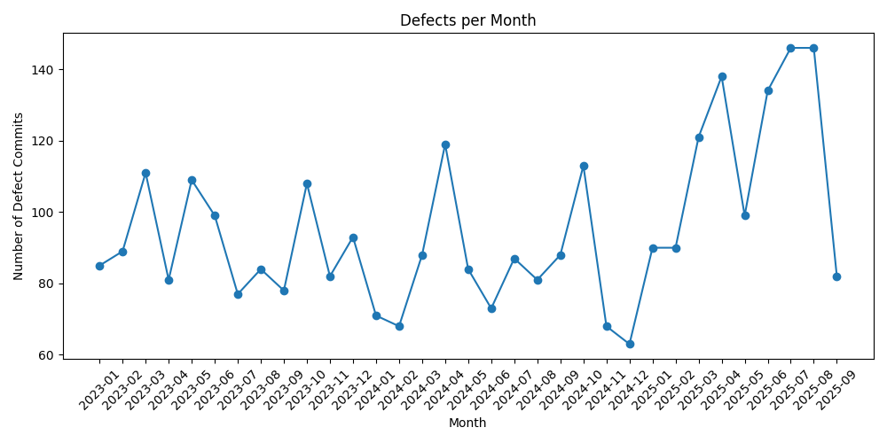
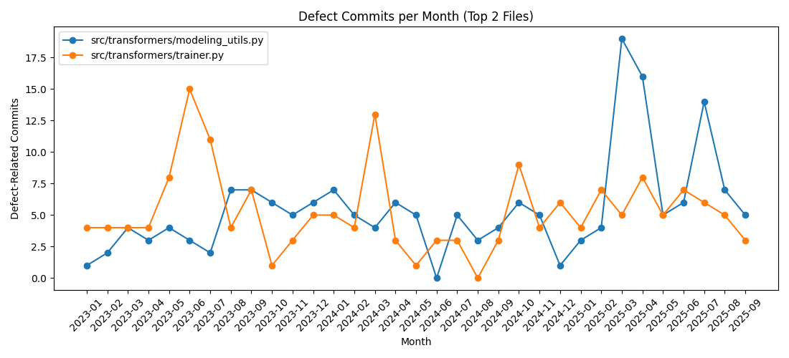
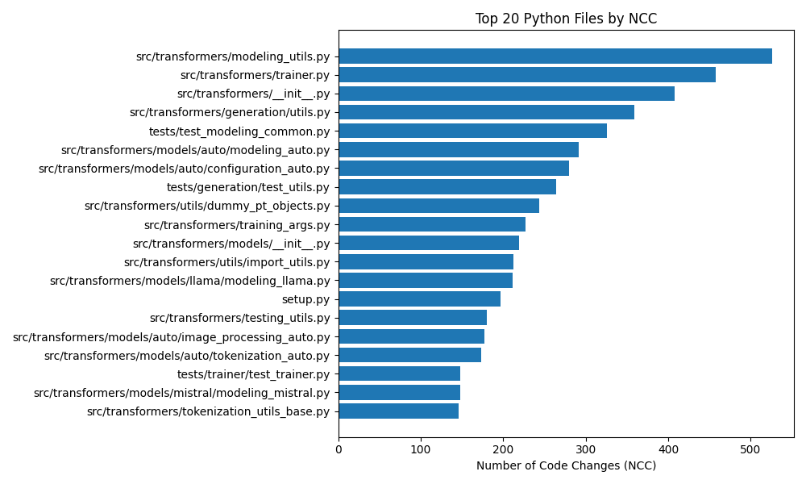
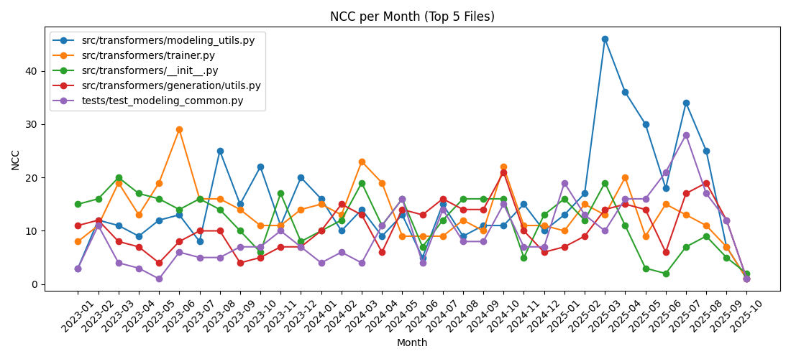
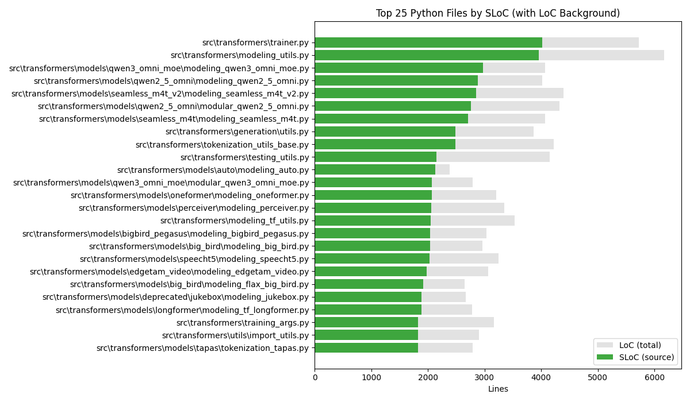
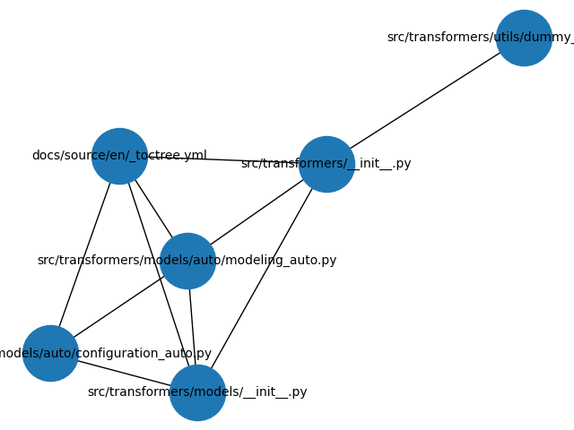
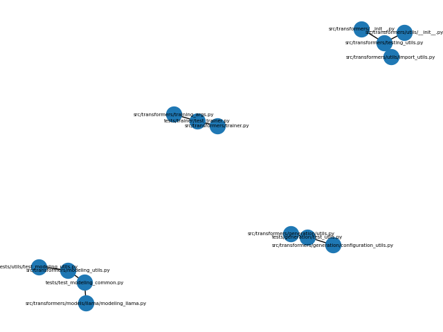

# Hugging Face Transformers Analysis

> **Status:** This repository is archived and no longer actively maintained.

This project was completed as part of the master's module *Fundamentals of Software Systems: Software Evolution* at the University of Zurich.

It provides a detailed analysis of defect trends, complexity hotspots, and logical coupling in the Hugging Face Transformers repository.

### Students
- Patric Brandao 21-534-607
- Noah Mattia Bussinger 22-700-835

---

## Task 1: Defect Analysis

To analyse defect-related commits in the Hugging Face Transformers repository, a dataset file (`commits_after_2023.txt`) was generated using a git log query. The commit range was restricted to dates after January 2023 and the release of **[Transformers v4.57.0](https://github.com/huggingface/transformers/releases/tag/v4.57.0)**, both to reduce computation time and to focus the analysis on the most recent phase of project evolution (as of time of analysis).

```bash
git log --since="2023-01-01" \
        --name-only \
        --pretty=format:"%H%x09%ad%x09%s" \
        --date=short \
        > commits_after_2023.txt
```

### Keyword-Based Defect Detection

Commit messages were preprocessed using scikit-learn’s English stopwords (reference).  
After cleaning and filtering the messages, the most frequent remaining meaningful terms were reviewed manually. Based on this review, the following keywords were selected to identify defect-related commits in the dataset:

- fix
- error
- bug
- issue

These keywords were then used throughout the analysis to classify and count defect-related commits.

### Defects Per Month

Using these keywords and the parsed commit metadata, the total number of defect commits per month was computed and visualized.  
This figure shows the defect commit distribution across months:



A clear drop in defect-related commits appears in **October 2025**.
This reduction is plausibly explained by the release of **[Transformers v4.57.0](https://github.com/huggingface/transformers/releases/tag/v4.57.0)** on **October 3, 2025**.
Because the release occurred early in the month, only a small number of days remained for further commits to be made and pushed, resulting in fewer defect-related commits during this period.

### File-Level Defect Hotspots
A further analysis was conducted to identify which files accumulated the highest number of defect commits.  
The two files with the most defect-related commits were isolated, and their defect counts were plotted over time.



The spike in defect-related commits in March 2025 for `modeling_utils.py` was, upon closer analysis, caused by a major refactor of `from_pretrained()`. Since `from_pretrained()` is the central mechanism for instantiating models from checkpoints, many architectures depend on its behavior. Updating this core function therefore required numerous downstream adjustments, resulting in a large number of follow-up fixes.

A similar situation occurred in June 2023 with `trainer.py`. A substantial restructuring landed in commit [`ebd94b0`](https://github.com/huggingface/transformers/commit/ebd94b0f6f215f6bc0f70e61eba075eb9196f9ef), which replaced the Trainer’s dataloader logic with a new Accelerate-based implementation. Because `trainer.py` is a foundational component of the training pipeline, this change affected many modules that interact with it, leading to another wave of corrective commits as the rest of the codebase was updated to align with the new design.

### Limitations of the Defect-Keyword Method

This keyword-based approach provides a rough estimate of defect activity but has several limitations:

1. **False positives:** Keywords like *fix* or *issue* may refer to documentation, tests, or minor cleanups rather than real defects.

2. **False negatives:** Many bug fixes do not include these keywords, causing true defects to be missed.

3. **Developer style bias:** Some contributors use explicit “fix:” messages, while others use neutral terms like “update” or “adjust,” skewing the counts.

4. **Refactor noise:** Large architectural changes trigger many follow-up “fix” commits, inflating defect numbers even when the root is singular.

Overall, keyword detection is simple and scalable but should be interpreted cautiously and supplemented with more detailed analysis.

---

## Task 2: Complexity Analysis

In this task, we analysed complexity using two metrics:

- **NCC (Number of Code Changes)**: An evolutionary complexity measure capturing how often files are modified.
- **SLoC (Source Lines of Code)**: A structural complexity measure capturing how much executable code a file contains.

Each metric highlights different types of hotspots.  
Below, we analyse them separately and compare them at the end.

### NCC Complexity Analysis

#### NCC Top 20


A ranked horizontal bar chart was used here because it makes comparative frequency immediately visible and allows high-churn files to stand out clearly. This type of chart is effective for hotspot analysis, where the goal is to identify which files dominate change activity.

The top 20 most frequently changed Python files can be grouped into several clear categories:

- **Core infrastructure:**  
  Modules that implement the fundamental mechanisms for model execution, training, and text generation.  
  Because many architectures depend on these shared components, even small changes can propagate widely, leading to frequent follow-up updates.  
  `modeling_utils.py`, `trainer.py`, `generation/utils.py`

- **Auto-model system:**  
  Responsible for mapping model names to their configuration and implementation classes.  
  Updated often as new architectures are introduced.  
  `modeling_auto.py`, `configuration_auto.py`

- **Initialization and API plumbing:**  
  Files managing imports, lazy loading, and dependency handling.  
  Touched frequently when extending or reorganizing the public API.  
  `__init__.py`, `dummy_pt_objects.py`

- **High-churn tests:**  
  Test modules that evolve together with major components, reflecting co-evolution rather than design issues.  
  `test_modeling_common.py`, `test_utils.py`, `test_trainer.py`

#### NCC per month for top 5 files



The monthly NCC line plot shows that these hotspot files remain active throughout the observed period, with several noticeable spikes.  
Such spikes typically correspond to larger refactors or architectural changes (e.g., updates to `from_pretrained()` or the Trainer/Accelerate integration), as already analysed in task 1.  
The sustained activity indicates that these modules act as evolution bottlenecks and represent areas where future changes may carry higher maintenance risk.

### SLoC Complexity Analysis

#### SLoC Hotspots (Structural Code Volume)

To compute the SLoC (Source Lines of Code) metric used in our structural complexity analysis, we wrote a helper script that is documented in the unused method `loc_sloc_analysis_transformers`.

This script uses the `radon` library to scan the `src/` directory of the transformer-repository and write the results to a file named `loc_sloc_src.txt`. These values were then used to generate the SLoC plots shown in the report.



The SLoC visualization highlights an important issue with using raw LoC (Lines of Code) as a complexity metric.
As seen in the chart, the total LoC (shown in gray) includes varying amounts of comments, docstrings, and empty lines, which artificially inflate the perceived size and complexity of many files.
To make this distortion visible, a ranked horizontal bar chart was used with LoC as a light background and SLoC as the foreground.
This layout clearly shows how raw LoC can exaggerate complexity and why SLoC provides a more meaningful measure.

By contrast, SLoC isolates only the executable lines of code, offering a clearer picture of true implementation complexity.
This makes SLoC a more reliable basis for identifying structural hotspots, since it reflects the actual logic a developer must understand or modify.

Using SLoC as the primary metric reveals a clear set of hotspot file types:

- **Large core abstractions:**  
  Files such as `trainer.py` and `modeling_utils.py` contain the core mechanisms for training, model loading, and parameter handling.
  Because many components depend on these abstractions, they accumulate significant executable logic and naturally stand out as SLoC-heavy.

- **Generation and tokenization utilities:**  
  Modules like `generation/utils.py` and `tokenization_utils_base.py` provide essential building blocks for text generation and text processing.
  Their broad applicability across many model architectures leads to dense implementations with many interrelated functions.

- **Model-specific implementations:**  
  Architectures such as Qwen, Seamless-M4T, and LLaMA contribute large modeling files with thousands of lines of code. 
  They are structurally large even if they do not change frequently.

Overall, the Top-25 SLoC results show a highly skewed distribution: although most files are relatively small, a small subset contains the majority of the core implementation logic.  
These are the files where structural complexity is concentrated and where targeted testing, documentation, or modularization efforts would have the highest impact.

### Correlation Between NCC and SLoC

Comparing the two complexity measures reveals that **NCC and SLoC correlate only weakly in the Transformers repository**. While a small number of files appear as hotspots in both metrics, the overall pattern shows that each captures a different aspect of complexity.

Several observations support this conclusion:

- **Overlap exists but is limited.**  
  Files such as `trainer.py`, `modeling_utils.py`, and `generation/utils.py` rank highly in both NCC and SLoC.
  These are large, central abstractions that both contain substantial logic and undergo frequent modification.
  However, these overlapping cases represent only a small portion of the overall dataset.

- **Many large files do not change often.**  
  The SLoC hotspots include a number of *model-specific* implementation files (e.g., Qwen, Seamless-M4T, LLaMA).
  These files are structurally large but relatively stable once introduced, meaning their SLoC is high but their NCC remains low.
  This weakens the overall correlation between the two measures.

- **Many frequently changed files are small.**  
  Files like `__init__.py`, `dummy_pt_objects.py`, or auto-model registration modules appear often in NCC rankings despite having low SLoC.
  Their high churn is driven by architectural integration rather than code volume, further decoupling NCC from SLoC.

**Conclusion:**  
In this repository, files with more executable code do not necessarily change more often, and files that change frequently are not necessarily large.
NCC highlights evolutionary hotspots, meaning files that are frequently touched because they connect different parts of the architecture.
SLoC highlights structural hotspots, meaning files that contain large amounts of actual implementation logic.
Because these two perspectives capture different forms of complexity, they complement one another but should not be treated as interchangeable measures.

---

## Task 3: Coupling Analysis

### Initial analysis

To analyse logical coupling in the Hugging Face Transformers repository, a dataset file (`commit_files_since_2023.txt`) was generated using a git log query. The commit range was restricted to dates after January 2023 and the release of **[Transformers v4.57.0](https://github.com/huggingface/transformers/releases/tag/v4.57.0)**, both to reduce computation time and to focus the analysis on the most recent phase of project evolution (as of time of analysis).

```bash
git log --since="2023-01-01" --name-only --pretty=format:"%H" > commit_files_since_2023.txt
```

The resulting top 10 most frequently co-changed file pairs are shown in the ouput log below.

```
('src/transformers/models/auto/configuration_auto.py', 'src/transformers/models/auto/modeling_auto.py') 229
('src/transformers/models/__init__.py', 'src/transformers/models/auto/configuration_auto.py') 209
('docs/source/en/_toctree.yml', 'src/transformers/models/auto/configuration_auto.py') 204
('src/transformers/models/__init__.py', 'src/transformers/models/auto/modeling_auto.py') 200
('src/transformers/__init__.py', 'src/transformers/utils/dummy_pt_objects.py') 196
('docs/source/en/_toctree.yml', 'src/transformers/models/__init__.py') 189
('docs/source/en/_toctree.yml', 'src/transformers/models/auto/modeling_auto.py') 189
('src/transformers/__init__.py', 'src/transformers/models/auto/modeling_auto.py') 183
('src/transformers/__init__.py', 'src/transformers/models/__init__.py') 170
('docs/source/en/_toctree.yml', 'src/transformers/__init__.py') 168
```

These top pairs can be visualized using the networkx graph visualization library and result in the following graph network below.



Further as tasked the topmost tightly coupled pair was selected as the following shown below. 

```
('src/transformers/models/auto/configuration_auto.py', 'src/transformers/models/auto/modeling_auto.py') 229
```

They are tightly coupled because any update to a configuration typically requires a corresponding change in the auto-model loader. Many commits modify both files together to maintain consistency. This logical coupling reflects functional dependency and co-evolution of related components rather than poor modularity, and it is expected for the auto functionality to work correctly.

### Test seperated analysis

To further investigate logical coupling within the Transformers repository, we repeated the coupling analysis while restricting file pairs to those where one file is a Python test file and the other is a Python source file. The goal was to understand how often tests and their corresponding implementation files evolve together.

The resulting top 10 coupled test–source pairs are shown in the ouput log below.

```
('src/transformers/generation/utils.py', 'tests/generation/test_utils.py') 122
('src/transformers/trainer.py', 'tests/trainer/test_trainer.py') 74
('src/transformers/testing_utils.py', 'src/transformers/utils/import_utils.py') 69
('src/transformers/modeling_utils.py', 'tests/test_modeling_common.py') 68
('src/transformers/testing_utils.py', 'src/transformers/utils/__init__.py') 64
('src/transformers/training_args.py', 'tests/trainer/test_trainer.py') 44
('src/transformers/modeling_utils.py', 'tests/utils/test_modeling_utils.py') 40
('src/transformers/generation/configuration_utils.py', 'tests/generation/test_utils.py') 39
('src/transformers/__init__.py', 'src/transformers/testing_utils.py') 35
('src/transformers/models/llama/modeling_llama.py', 'tests/test_modeling_common.py') 33
```

These top pairs can be visualized using the networkx graph visualization library and result in the following graph network below.




Further as tasked the topmost tightly coupled pair was selected as the following shown below.

```
('src/transformers/generation/utils.py', 'tests/generation/test_utils.py') 122
```

The pair with 122 shared commits shows a very strong relationship, and this level of coupling is natural given their roles. The file `src/transformers/generation/utils.py` provides core utilities for the generation pipeline, while `tests/generation/test_utils.py` contains the tests that verify the correctness of those utilities. Because the test file is designed specifically for this module, both files evolve together whenever new generation features are introduced, bugs are fixed, or existing behavior is adjusted. This consistent co-evolution reflects healthy development rather than a structural issue and indicates that the project maintains good test coverage and clear alignment between tests and implementation. The shared location within the same functional area further supports their close relationship and reinforces that this coupling is intentional and beneficial.

> To answer the specific question to this task, the strong coupling between test files and their corresponding source files is normal and reflects the way tests evolve together with the code they verify. This pattern generally indicates healthy maintenance rather than a structural problem. It becomes concerning only when a single test file frequently changes alongside many unrelated source files, which can suggest overly broad tests or weak isolation. In the results observed here, the relationships are focused and consistent, so the coupling appears natural and not a sign of needed refactoring.

### Pynguin test generation

To determine where Pynguin should place automatically generated tests, we can rely on several ways of identifying the test file that is most closely connected to a given source file. 

- One approach is to analyze **commit history** and select the test file that has most often changed together with the source file, since frequent co-evolution suggests a strong relationship. 
- Another option is to compare **names and directory structures** by choosing the test file whose naming pattern or location matches the structure of the target module. 
- A further method is to examine existing test **imports and static usage patterns** to find which test file currently exercises or references the source file. 

Additional strategies such as analyzing dependency graphs or evaluating directory proximity could also support this decision.

### Test placement methods

Several strategies for determining which test file is most closely related to a given non-test .py file were proposed. For this sub task, two of these methods were implemented:

#### Method 1: Name-Based Test File Matching

This approach selects the test file whose name most closely matches the non-test file’s name. It mimics standard project conventions such as appending `test_`.

- Extract the base name of the input file.
- Search the `tests` directory for test files containing the base name.
- If no strict match is found, fall back to partial matches.
- Return the most likely match, or None if no match is found.

> The method would therefore place `src/transformers/generation/utils.py` to `tests/test_generation_utils.py`.

This is expected because the naming pattern directly mirrors the structure of the source file. The name-based approach is deterministic and works well in repositories that follow naming conventions strictly.

#### Method 2: Commit-Based Logical Coupling

This method uses Git history to determine which test file is most often committed together with the target Python file. The intuition is that files that change together over time are likely logically related.

- Parse historical commits and reconstruct file co-occurrences.
- Identify all commits involving the target file.
- Among all associated files, filter only Python test files.
- Select the test file with the highest co-occurrence count.

> The method would therefore place `src/transformers/generation/utils.py` to `tests/test_generation.py`.

This result is also reasonable. Historically, multiple generation-related utilities and helper functions in the Transformers project are exercised in combined test modules. The broader test file is likely frequently updated alongside changes to `generation/utils.py`. This indicates that the generation utilities influence multiple parts of the generation pipeline. Also tests for multiple related components may live in a shared test module. Name-based and commit-based methods may disagree, but both choices are valid depending on desired granularity.

---

## Usage of AI

We used AI tools to support a few focused, non-substantive parts of this assignment. Specifically, AI assistance was used to:

- Create the command for getting the git logs
- Improve the formatting and wording of this README for clarity and readability.  
- Refine console output (“pretty prints”) to make results easier to interpret.  
- Help create regular expressions used in the analysis.  
- Assist with Matplotlib plotting code.

All analytical decisions, interpretations of results, and final write-ups were produced by the authors.


